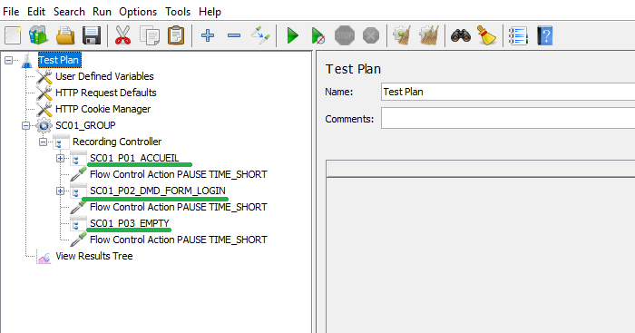
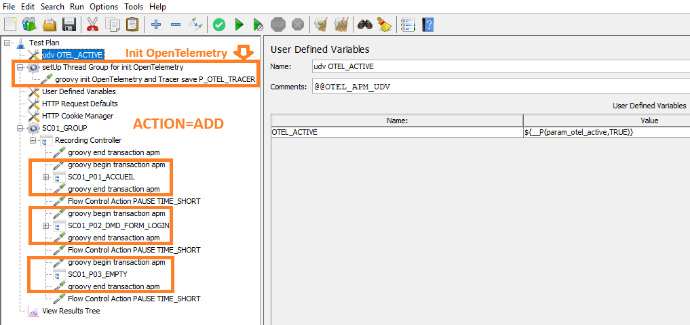
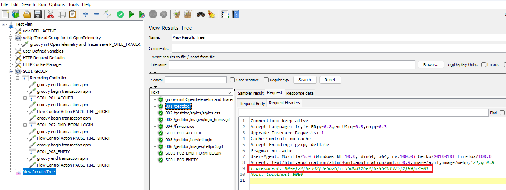
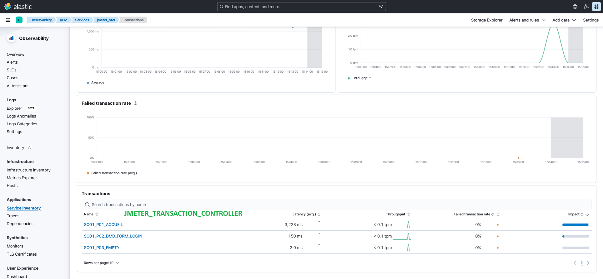
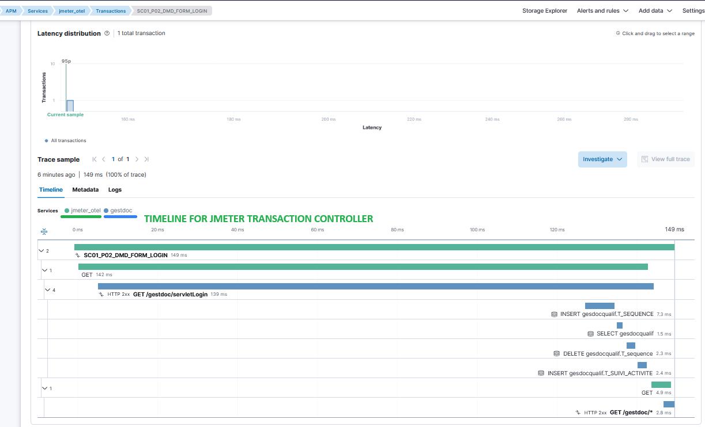
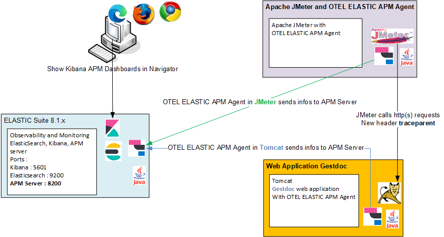
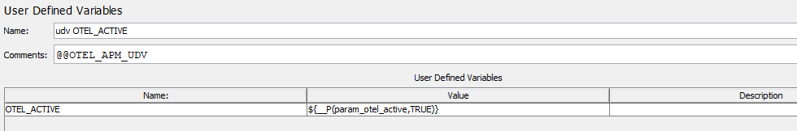

<p align="center">


  <p align="center">Manages the integration of OpenTelemetry from Elastic Application Performance Monitoring API in the Apache JMeter.</p>
  <p align="center"><a href="https://github.com/vdaburon/jmeter-otel-apm">Link to github project jmeter-otel-apm</a></p>
</p>

# Apache JMeter with integration of OpenTelemetry (OTEL) from Elastic Application Performance Monitoring (APM)
This tool manages the integration of OTEL from Elastic Application Performance Monitoring Agent in the Apache JMeter.

The main goal is to show the timeline of pages declared in JMeter script in the Kibana APM. For each page on the JMeter side, have all the server-side calls grouped together, the SQL queries and the inter-application exchanges in the notion of page.

This tool adds JSR223 groovy sampler to create a new OTEL Transaction (span with no parent) before a JMeter Transaction Controller
and adds JSR223 groovy sampler to end the transaction after the JMeter Transaction Controller

This tool **adds** also User Defined Variables for OTEL_ACTIVE configuration and a setUp Thread Group for init OpenTelemetry contains JSR22 Groovy code

This tool could **remove** all JSR223 groovy that contains otel api calls to return to the initial JMeter script.<br/>
Becarfule, don't add new components to the "setUp Thread Group for init OpenTelemetry" because the "setUp Thread Group" will be remove and all children

##  Example
A simple JMeter script with 3 Transaction Controller corresponding to 3 different pages



Launch the tool to modify the script : script1.jmx
<pre>
java -jar jmeter-otel-apm-&lt;version&gt;-jar-with-dependencies.jar -file_in script1.jmx -file_out script1_add.jmx -action ADD -regex SC.*
</pre>
and the script (script1_add.jmx) after **action** = **ADD**

Add a User Defined Variables "OTEL_ACTIVE" and<br/>
a setUp Thread Group for init OpenTelemetry contains (JSR2233 Sampler) groovy init OpenTelemetry  and Tracer save in property "P_OTEL_TRACER" (simplified code) :
<pre>
OpenTelemetry openTelemetry = GlobalOpenTelemetry.get();
Tracer tracer = openTelemetry.getTracer("vdn.jmeter.otel");
props.put("P_OTEL_TRACER",tracer);
</pre>

Each JMeter Transaction Controller (page) is surround with a begin transaction and an end transaction (use groovy otel api call).

In the "groovy begin transaction apm", the groovy code calls the OTEL API (simplified code) :
<pre>
Tracer tracer = props.get("P_OTEL_TRACER");
Span span = tracer.spanBuilder(transactionName).setNoParent().startSpan(); // transactionName is the name of the Transaction Controller
Scope ignored = span.makeCurrent()
vars.putObject("V_OTEL_TRANSACTION_TC", span);
</pre>

And in the "groovy end transaction apm", the groovy code calls the OTEL API  (simplified code):
<pre>
Span span = (Span) vars.getObject("V_OTEL_TRANSACTION_TC");
span.end();
</pre>



In View Results Tree, you will see new request headers (traceparent) automatically added by the otel elastic apm agent with the traceparent id (e.g: 00-ef72fbe342f3e5a76fcc55d0d126e2f6-95461375f2f89fc4-01) created by the jsr223 groovy begin transaction apm.



You will see all Transactions in Kibana with the vision of the page in JMeter (JMeter Transaction Controller usually == page) (click on image to see the full size image)



And the TIMELINE for JMeter Transaction Controller, you see the JMeter Page and the web application gestdoc running in Tomcat (click on image to see the full size image)



## Simplified architecture diagram
The simplified architecture : Apache JMeter and a java otel elastic agent, Apache Tomcat and the java otel elastic agent with web application gestdoc, ElasticSearch suite with ElasticSearch, APM Server and Kibana, a user views the Kibana Dashboards with navigator.



## License
See the LICENSE file Apache 2 [https://www.apache.org/licenses/LICENSE-2.0](https://www.apache.org/licenses/LICENSE-2.0)

## Ready to use
In the [Release of the project](https://github.com/vdaburon/jmeter-otel-apm/releases)  you will find the tool compiled in one (uber) jar file which is directly usable.

## Also a JMeter plugin
This tool have a Swing GUI Interface in JMeter.<br/>
The JMeter plugin is call "vdn@github - OTEL ELASTIC APM Integration Tool" <br/>
Link to this project plugin : https://github.com/vdaburon/otel-apm-jmeter-plugin

## Help
<pre>
[main] INFO io.github.vdaburon.jmeter.otelxml.OtelJMeterManager - main begin
usage: io.github.vdaburon.jmeter.otelxml.OtelJMeterManager -action &lt;action&gt; [-extract_end &lt;extract_end&gt;] [-extract_start
       &lt;extract_start&gt;] [-extract_udv &lt;extract_udv&gt;] -file_in &lt;file_in&gt; -file_out &lt;file_out&gt; [-help] [-regex &lt;regex&gt;]
io.github.vdaburon.jmeter.otelxml.OtelJMeterManager
 -action &lt;action&gt;                 action ADD or REMOVE, ADD : add groovy api call and REMOVE : remove groovy api call
 -extract_end &lt;extract_end&gt;       optional, file contains groovy end call api (e.g : extract_end.xml), default read file
                                  in the jar
 -extract_start &lt;extract_start&gt;   optional, file contains groovy start call api (e.g : extract_start.xml), default read
                                  file in the jar
 -extract_udv &lt;extract_udv&gt;       optional, file contains User Defined Variables and setUp Thread Group for init
                                  OpenTelemetry (e.g : extract_udv.xml), default read file in the jar
 -file_in &lt;file_in&gt;               JMeter file to read (e.g : script.jmx)
 -file_out &lt;file_out&gt;             JMeter file modified to write (e.g : script_add.jmx)
 -help                            Help and show parameters
 -regex &lt;regex&gt;                   regular expression matches Transaction Controller Label (default .*) (e.g : SC[0-9]+_.
                                  for SC01_P01_HOME or SC09_P12_LOGOUT)
E.g : java -jar jmeter-otel-apm-&lt;version&gt;-jar-with-dependencies.jar -file_in script1.jmx -file_out script1_add.jmx
-action ADD -regex SC.*
E.g : java -jar jmeter-otel-apm-&lt;version&gt;-jar-with-dependencies.jar -file_in script1_add.jmx -file_out
script1_remove.jmx -action REMOVE -regex .*

</pre>

## Properties in the User Defined Variables

This tool add "User Defined Variables" with default value



This variable could be changed with JMeter properties at launch time, this properties could be set with -J&lt;property&gt;

OTEL properties are :

| property name     | comment                                                                                          |
|-------------------|--------------------------------------------------------------------------------------------------|
| param_otel_active | default : TRUE , TRUE OR FALSE, if TRUE then api is call                                         |

E.g : jmeter -Jparam_otel_active=TRUE

## Limitation at one level Transaction Controller
The main limitation of this tool is only one Transaction Controller level. You can't instrument a Transaction Controller that contains others Transaction Controller because the groovy script use ONE variable to save the Transaction Controller Label. The Parent Transaction Controller set the label and the children Transaction Controller set the same variable and overwrite previous parent label. As a result, the parent will not have an end of transaction.

You can manually remove the groovy code before the parent Transaction Controller or give the regular expression for only children Transaction Controller.

## Start Apache JMeter with OTEL ELASTIC APM agent

### Declare the OTEL ELASTIC APM Agent
Observabity APM OpenTelemetry documentation : https://www.elastic.co/guide/en/observability/current/apm-open-telemetry.html

The ELASTIC OTEL JAVA documentation is available at : https://github.com/elastic/elastic-otel-java/tree/main/docs

GitHub project : https://github.com/elastic/elastic-otel-java

Url to download the OTEL APM Agent : [https://mvnrepository.com/artifact/co.elastic.otel/elastic-otel-javaagent/](https://mvnrepository.com/artifact/co.elastic.otel/elastic-otel-javaagent/)

Add the OTEL ELASTIC APM Agent somewhere in the filesystem (could be in the &lt;JMETER_HOME&gt;\lib but not mandatory)

In &lt;JMETER_HOME&gt;\bin modify the jmeter.bat or setenv.bat

Add OTEL ELASTIC APM configuration likes (simple configuration with no security between apm server and OTEL Java Agent) :
<pre>
set PARAM_OTEL_SERVICE_NAME=jmeter_otel
set PARAM_OTEL_RESOURCE_ATTRIBUTES=deployment.environment=my_env
set PARAM_OTEL_EXPORTER_OTLP_ENDPOINT=http://apmserver:8200
set PARAM_OTEL_AGENT_PATH=/otel_agent_java/elastic-otel-javaagent-&lt;version&gt;.jar

set JVM_ARGS=-javaagent:%PARAM_OTEL_AGENT_PATH% -Dotel.service.name=%PARAM_OTEL_SERVICE_NAME% -Dotel.resource.attributes=%PARAM_OTEL_RESOURCE_ATTRIBUTES% -Dotel.exporter.otlp.endpoint=%PARAM_OTEL_EXPORTER_OTLP_ENDPOINT%
</pre>

Another solution, create a windows shell likes <code>jmeter_otel_agent.bat</code> in the &lt;JMETER_HOME&gt;\bin:
<pre>
set PARAM_OTEL_SERVICE_NAME=jmeter_otel
set PARAM_OTEL_RESOURCE_ATTRIBUTES=deployment.environment=my_env
set PARAM_OTEL_EXPORTER_OTLP_ENDPOINT=http://apmserver:8200
set PARAM_OTEL_AGENT_PATH=/otel_agent_java/elastic-otel-javaagent-&lt;version&gt;.jar

set JVM_ARGS=-javaagent:%PARAM_OTEL_AGENT_PATH% -Dotel.service.name=%PARAM_OTEL_SERVICE_NAME% -Dotel.resource.attributes=%PARAM_OTEL_RESOURCE_ATTRIBUTES% -Dotel.exporter.otlp.endpoint=%PARAM_OTEL_EXPORTER_OTLP_ENDPOINT% & jmeter.bat 
</pre>
Remark the **& jmeter.bat** at end of the line with set JVM_ARGS

## Use jmeter maven plugin and OTEL ELASTIC APM java agent
You could launch a load test with the jmeter maven plugin and OTEL ELASTIC APM Agent

[https://github.com/jmeter-maven-plugin/jmeter-maven-plugin](https://github.com/jmeter-maven-plugin/jmeter-maven-plugin)

Paths are relative to the home maven project
- Put your csv files in <project>/src/test/jmeter directory (e.g : logins.csv)
- Put the elastic-otel-javaagent-${otel_apm_version}.jar in <project>/src/test/jmeter directory
- Put  your jmeter script that contains groovy code added with **jmeter-otel-apm** tool in <project>/src/test/jmeter directory (e.g : script1_add.jmx)
- In the jMeterProcessJVMSettings > arguments add otel apm agent configuration likes:
<pre>
<jMeterProcessJVMSettings>
<arguments>
<argument>-javaagent:${project.build.directory}/jmeter/testFiles/elastic-otel-javaagent-${otel_version}.jar</argument>
<argument>-Dotel.service.name=${otel_service_name}</argument>
<argument>-Dotel.resource.attributes=${otel_environment}</argument>
<argument>-Dotel.exporter.otlp.endpoint=${otel_otlp_endpoint}</argument>
</arguments>
</jMeterProcessJVMSettings>
</pre>

A pom.xml example, the otel_version is set to "1.1.0" for the OTEL ELASTIC APM Agent agent:
```XML
<project xmlns="http://maven.apache.org/POM/4.0.0" xmlns:xsi="http://www.w3.org/2001/XMLSchema-instance"
         xsi:schemaLocation="http://maven.apache.org/POM/4.0.0 https://maven.apache.org/xsd/maven-4.0.0.xsd">
    <modelVersion>4.0.0</modelVersion>
    <groupId>io.github.vdaburon.jmeter</groupId>
    <artifactId>gestdoc-maven-launch-loadtest-otel-apm</artifactId>
    <version>1.0</version>
    <properties>
        <project.build.sourceEncoding>UTF-8</project.build.sourceEncoding>
        <maven.compiler.source>1.8</maven.compiler.source>
        <maven.compiler.target>1.8</maven.compiler.target>
        <jvm_xms>256</jvm_xms>
        <jvm_xmx>756</jvm_xmx>

        <!-- OTEL Elastic APM Java Agent -->
        <otel_version>1.1.0</otel_version>
        <otel_service_name>YourServiceNane</otel_service_name>
        <otel_environment>deployment.environment=YourEnvironment</otel_environment>
        <otel_otlp_endpoint>http://apm_server:8200</otel_otlp_endpoint>
    </properties>

    <build>
        <plugins>
            <plugin>
                <!-- launch test : mvn clean verify -->
                <groupId>com.lazerycode.jmeter</groupId>
                <artifactId>jmeter-maven-plugin</artifactId>
                <version>3.6.1</version>
                <executions>
                    <!-- Generate JMeter configuration -->
                    <execution>
                        <id>configuration</id>
                        <goals>
                            <goal>configure</goal>
                        </goals>
                    </execution>
                    <!-- Run JMeter tests -->
                    <execution>
                        <id>jmeter-tests</id>
                        <goals>
                            <goal>jmeter</goal>
                        </goals>
                    </execution>
                </executions>
                <configuration>
                    <jmeterVersion>5.5</jmeterVersion>
                    <downloadExtensionDependencies>false</downloadExtensionDependencies>
                    <jMeterProcessJVMSettings>
                        <xms>${jvm_xms}</xms>
                        <xmx>${jvm_xmx}</xmx>
                        <arguments>
                            <argument>-javaagent:${project.build.directory}/jmeter/testFiles/elastic-otel-javaagent-${otel_version}.jar</argument>
                            <argument>-Dotel.service.name=${otel_service_name}</argument>
                            <argument>-Dotel.resource.attributes=${otel_environment}</argument>
                            <argument>-Dotel.exporter.otlp.endpoint=${otel_otlp_endpoint}</argument>
                            <argument>-Duser.language=en</argument>
                        </arguments>
                    </jMeterProcessJVMSettings>
                    <testFilesIncluded>
                        <jMeterTestFile>script1_add.jmx</jMeterTestFile>
                    </testFilesIncluded>
                    <logsDirectory>${project.build.directory}/jmeter/results</logsDirectory>
                    <generateReports>false</generateReports>
                    <testResultsTimestamp>false</testResultsTimestamp>
                    <resultsFileFormat>csv</resultsFileFormat>
                </configuration>
            </plugin>
        </plugins>
    </build>
</project>
```
### Usage Maven
The maven groupId, artifactId and version, this plugin is in the **Maven Central Repository** [](https://maven-badges.herokuapp.com/maven-central/io.github.vdaburon/jmeter-elastic-apm)

```xml
<groupId>io.github.vdaburon</groupId>
<artifactId>jmeter-otel-apm</artifactId>
<version>1.0</version>
```

## Advanced usage
### Change the XML extract file
The action ADD of this tool is reading 3 XML files that contains extract of the XML JMeter script to add the 1) "User Defined Variables and setUp Thread Group for init OpenTelemetry", 2) "JSR223 groovy begin transaction apm" and 3) "JRS223 groovy end transaction apm".

These files are include in the tool jar file.

You can change the XML files to include by indicating the path to the new XML files with the parameters -extract_udv or -extract_start or -extract_end

You want to change the "JSR223 start transaction apm" with your own file.

E.g. : 
<pre>
java -jar jmeter-otel-apm-&lt;version&gt;-jar-with-dependencies.jar -file_in script1.jmx -file_out script1_add.jmx -action ADD -regex SC.* -extract_start my_xml_file.xml
</pre>

You want to change all 3 files with yours XML files.

E.g. : 
<pre>
java -jar jmeter-otel-apm-&lt;version&gt;-jar-with-dependencies.jar -file_in script1.jmx -file_out script1_add.jmx
-action ADD -regex SC.* -extract_start my_xml_start_file.xml -extract_end my_xml_end_file.xml -extract_udv my_xml_udv_file.xml
</pre>

Another solution is to open the tool jar file with 7zip and replace the 3 files by yours files but **keep the same XML file name** and save the new jar.

## Reserved tags
This tool is looking to **reserved tags** or special string in the XML extract files or in the JMeter script to **REMOVE** previously add JSR223 Samplers, User Defined Variables and "setUp Thread Group for init OpenTelemetry".

This tags are :
- In the "JSR223 groovy start transaction apm", the reserved tags are : "@@TC\_NAME" in the Parameters text field, this string will be replaced by the label of the following Transaction Controller and the "@@OTEL\_APM\_BEGIN" in the Comment text field
- In the "JRS223 groovy end transaction apm", the reserved tag is "@@OTEL\_APM\_END" in the Comment text field
- In the "User Defined Variables", the reserved tag is "@@OTEL\_APM\_UDV" in the Comment text field
- In the "setUp Thread Group", the reserved tag is "@@OTEL\_SETUP\_INIT\_TRACER

## Call this tool likes a library
To call this tool in an other tool, add the jar jmeter-otel-apm-&lt;version&gt;-jar and this 2 libraries dependence (common-cli and org.slf4j) in the classpath and :
<pre>
import io.github.vdaburon.jmeter.otelxml.OtelJMeterManager;

String sRegexTc = ".*";
String sFileIn = "script1.jmx";
String sFileOut = "script1_add.jmx";
OtelJMeterManager.modifyAddSamplerForOtelApm(sFileIn, sFileOut, OtelJMeterManager.ACTION_ADD, sRegexTc, OtelJMeterManager.EXTRACT_START_JSR223, OtelJMeterManager.EXTRACT_END_JSR223, OtelJMeterManager.EXTRACT_UDV_ELASTIC);
</pre>

## Versions
Version 1.0 2025-01-15, First version of this tool.
